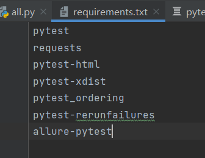

# pytest规范

## pytest简介
1. 基于python的单元测试框架，他可以和selenium、requests、appium结合实现自动化测试；
2. 实现用例跳过（skip）和失败用例重跑（reruns）；
3. 可以结合allure-pytest插件生成allure报告；
4. 很方便的和jenkis实现持续集成
5. 很多强大的插件
    * pytest-html 生成html测试报告
    * pytest-xdist 多线程执行测试用例
    * pytest_ordering 改变测试用例的执行顺序
    * pytest-rerunsfailures 失败用例重跑
    * allure-pytest 生成allure测试报告


### 1.三方包的安装
* 新建 requirements.txt 写入需要安装的第三方包名
* 通过pip install -r requirements.txt
* 项目所有的依赖包都需要写入此文件，方便后续项目移动使用  

  

### 2.pytest最基本的测试用例规则
1. 测试文件名必须以test_开头或者以_test结尾
2. 测试类类名必须以Test*开头，并且不能带有__init__方法
3. 测试用例必须以test_开头

* Ps： 命名规范
    * 模块名：一般全小写，多个英文之间用_隔开  
    * 类名： 一般都是首字母大写
    * 方法名: 一般全小写，多个英文之间用_隔开
    

### 3.pytest常见参数
* 常见参数
    * -V:输出更多详细信息，比如文件名，用例名称
    * -S:输出调试信息；打印信息等 
    * --reruns 数字:失败重跑
    * -X: 出现1个失败就停止测试
    * --maxfail=2 出现N个失败就终止测试
    * --html=report.html 生成html的测试报告
    * -n 多线程
    * -k 运行测试用例名称包含指定字符串的用例
        * pytest.main(['-vs','-k','weiwei or baili'])
        * pytest.main(['-vs','-k','weiwei and baili'])
  

### 4.pytest运行测试用例的方式  
1.主函数方式
```python
import pytest
if __name__ == '__main__':
    # 不加任何参数运行
    pytest.main() 
    # 指定模块运行
    # pytest.main(['‐vs','testcases/test_api2.py']) 
    # 指定文件夹运行
    # pytest.main(['‐vs','testcases/']) 
    # 通过node id 方式运行测试用例
    # pytest.main(['‐vs','testcases/test_api.py::TestApi::test_product_manage_weiwei'])
```
2. 命令行方式运行
```python
pytest
```
3. 通过pytest.ini配置文件运行（不管是命令行还是主函数都会调用这个配置文件）
```ini
[pytest] # 用于标记这个文件是pytest的配置文件
# 命令行参数 多个参数之间用空格隔开
addotps = -VS
# 配置搜索测试用例的范围
testpaths = testcase/
# 设置默认搜索用例文件的名称规则
python_files = test_*.py
# 设置默认搜索用例类的名称规则
python_classes = Test*
# 设置默认搜索用例方法的名称规则
python_functions = test_*
# 用例分组
marks = 
    smokes:冒烟用例
    productmanage:商品模块管理
```


### 5.pytest执行指定标记用例  mark
```python
import pytest
class Testdemo:
    @pytest.mark.smoke
    def test_fun(self):
        print('测试用例1')
```
通过在pytest.ini文件中增加参数来指定运行带有标记的用例
```ini
addotps = -vs -m smokes
markers =
    smoke: smoke
    test_one: testflag
    test_two: testflag
```

### 6.pytest改变用例执行顺序 order
通过增加@pytest.mark.run(order=1) 标记来该表测试用例的执行顺序  
增加标记后会自动执行。


### 7.pytest的跳过测试用例  skip、skipif
1. 无条件跳过 skip
```python
@pytest.mark.skip(reason='这是跳过备注')
def test_fun():
    print('测试用例')
```
2. 有条件跳过 skipif
```python
@pytest.mark.skipif(2>1,reason='跳过条件备注')
def test_fun():
    print('测试用例')
```

### 8.pytest的前置后置  setup（）和 teardowm（）函数以及fixture装饰器
1. 通过函数实现前后置
```python
def setup_module():
    print("在每个模块之前执行")
def teardown_module():
    print("在每个模块之后执行")
```

```python
class Testdemo:
    def setup_class(self):
        print('在每个类之前执行')
    def teardown_class(self):
        print('在每个类之后执行')
```

```python
class Testdemo:
    def setup(self):
        print('在每个用例之前执行')
    def teardown(self):
        print('在每个用例之后执行')
```
2. 使用fixture实现前后置
    * 语法: ```@pytest.fixture(scope="作用域",params="数据驱动",autouser="自动执行"，ids="自定 义参数名称"，name="别名")```
        * scope 作用域
            1.function: 在每个方法的前后执行一次
            2. class: 在每个类的前后执行一次
            3. module: 在每个py文件前后执行一次
            4. package/session:在每个package包钱后执行一次
    * 使用方法  
        在用例内增加前后置方法，通过在方法上增加@pytest.fixture(scope="session")装饰器来实现前置  
        在方法内使用yield函数，在函数后编写后置方法  
        package、sesion级别，一般是和connftest.py文件一起使用
    * 方法级别的调用
    ```python
    import pytest   
    # 设置函数的前后置方法，使用yield后置 
    @pytest.fixture(scope='function')
    def front():
       print('这里是前置的方法')
       yield 
       print('这里是后置的方法')
    ```
    ```python
    # 手动调用
    def test_fun(self, front):
       print('测试用例')
    ```
   * 类级别的调用
    ```python
    @pytest.mark.usefixtures("front")
    class TestApi2:

        def test_duo_class(self):
            print("多个类的情况")
    ```
   * <font color='red'>注意： 如果fixture参数中加入autouse=True，那么表示所有设置的作用域都会自动使用，不需要手动调用</font>
   * fixture 数据params这里的params用于传输数据（list，tuple，字典列表，字典元祖），需要在夹 具里面通过request（固定写法）接收，然后通过request.param（固定写法） 获取数据，然后再通过yield把数据返回到测试用例中，然后使用
    ```python
    # 模拟数据驱动
    def yml_data():
        return [['小李', '小张', '小王'], ['小李2', '小张2', '小王2'], ['小李3', '小张3', '小王3']]

    @pytest.fixture(scope='function', autouse=True, params=yml_data())
    def execute_sql(request):
        print('\n', '使用fixture实现前后置，这是前置'.center(50, '-'))
        yield request.param  # 通过yield 实现数据返回，yield后面实现后置方法
        print('\n', '使用fixture实现前后置，这是后置'.center(50, '-'))
    ```

### 9.pytest中conftest.py文件的使用
* 名称是固定的conftest.py，主要用于单独存放fixture固件
* conftest文件中的fixture不需要导包可以直接使用
* conftest文件可以有多个


### 10.assert 断言
```python
    @allure.story('test_fun9')
    def test_fun9(self, execute_sql):
        print('测试用例 —— 9 --定义类标签mark=smoke' + "  |   返回的数据:")
        assert execute_sql[0] == '小李'
```